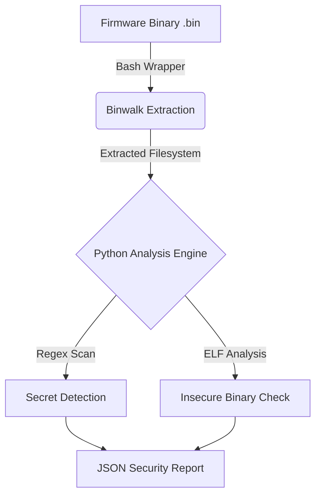

# Automated IoT Firmware Vulnerability Scanner

## Project Overview
This tool automates the reverse engineering and security analysis of IoT firmware. It extracts the filesystem from binary firmware images (using Binwalk) and performs static analysis to detect:
1.  **Hardcoded Secrets:** API keys, private certificates, and passwords.
2.  **Legacy C Vulnerabilities:** Dangerous functions (like `strcpy`, `system`) that lead to buffer overflows and command injection.

## Architecture


## Technology Stack
* **Bash Scripting:** Automation pipeline.
* **Python:** Static Analysis Security Testing (SAST).
* **Binwalk:** Firmware extraction.
* **Linux/Kali:** Operating environment.

## How to Run
```bash
# 1. Clone the repository
git clone https://github.com/YOUR_USERNAME/IoT_Vuln_Scanner.git

# 2. Run the scanner on a target firmware
sudo ./iot_scanner.sh target_firmware.bin
```

## Sample Output
The tool generates a `scan_report.json` file identifying specific vulnerabilities:
```json
{
    "type": "Insecure Function",
    "match": "strcpy",
    "file": "_target.bin.extracted/squashfs-root/usr/bin/login"
}
```

## Why This Matters
IoT devices often ship with insecure legacy code. This tool simulates an attacker's workflow to identify low-hanging fruit vulnerabilities before deployment.
